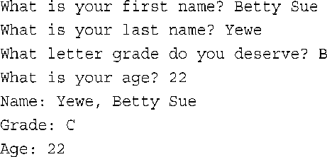
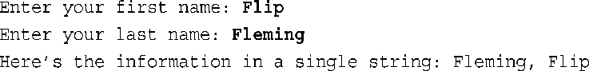

# 第四章 复合类型

- 创建和使用数组。
- 创建和使用C-风格字符串。
- 创建和使用string类字符串。
- 使用方法getline( )和get( )读取字符串。
- 混合输入字符串和数字。
- 创建和使用结构。
- 创建和使用共用体。
- 创建和使用枚举。
- 创建和使用指针。
- 使用new和delete管理动态内存。
- 创建动态数组。
- 创建动态结构。
- 自动存储、静态存储和动态存储。
- vector和array类简介。

> 结构
>
> 共用体联合union
>
> 枚举
>
> 指针
>
> 使用new来分配内存
>
> 使用delete释放内存
>
> vector
>
> array

## 复习题

1. 如何声明下述数据

   > a. actor是由30个char组成的数组。
   >
   > b. betsie是由100个short组成的数组。
   >
   > c. chuck是由13个float组成的数组。
   >
   > d. dipsea是由64个long double组成的数组.
   >
   > ```c++
   > char actor[30];
   > short betsie[100];
   > float chuck[13];
   > long double disea[64];
   > ```

2. 使用模板类array而不是数组来完成问题1

   ```c++
   array<char, 30> actor;
   array<short, 100> betsie;
   array<float, 13> chuck;
   array<long double, 64> disea;
   ```

3. 声明一个包含5个元素的int数组，并将它初始化为前5个正奇数。

   ```c++
   int a[5] = {1, 3, 5, 7, 9};
   ```

4. 编写一条语句，将问题3中数组第一个元素和最后一个元素的和赋给变量even。

   ```c++
   int even = a[0] + a[4];
   ```

5. 编写一条语句，显示float数组ideas中的第2个元素的值。

   ```c++
   std::cout << ideas[1] << std::endl;
   ```

6. 声明一个char的数组，并将其初始化为字符串“cheeseburger”。

   ```c++
   char str[] = "cheesseburger";
   ```

7. 声明一个string对象，并将其初始化为字符串“Waldorf Salad”

   ```c++
   std::string str {"waldorf Salad"};
   ```

8. 设计一个描述鱼的结构声明。结构中应当包括品种、重量（整数，单位为盎司）和长度（英寸，包括小数）。

   ```c++
   struct Fish {
       char variety[20];
       int weight;
       double height;
   };
   ```

9. 声明一个问题8中定义的结构的变量，并对它进行初始化

   ```c++
   Fish fish = {"yellow fish", 20, 23.3};
   ```

10. 用enum定义一个名为Response的类型，它包含Yes、No和Maybe等枚举量，其中Yes的值为1，No为0，Maybe为2。

    ```c++
    enum Response{NO = 0, Yes, Maybe};
    ```

11. 假设ted是一个double变量，请声明一个指向ted的指针，并使用该指针来显示ted的值。

    ```c++
    double *pd = &ted;
    std::cout << *pd << std::endl;
    ```

12. 假设treacle是一个包含10个元素的float数组，请声明一个指向treacle的第一个元素的指针，并使用该指针来显示数组的第一个元素和最后一个元素。

    ```c++
    float *p = treacle;
    std::cout << *p << '\t' << *(p+9) << std::endl; 
    ```

13. 编写一段代码，要求用户输入一个正整数，然后创建一个动态的int数组，其中包含的元素数目等于用户输入的值。首先使用new来完成这项任务，再使用vector对象来完成这项任务。

    ```c++
    int n;
    cin >> n;
    int a[n] = new int [];
    vector<int> a(n);
    ```

14. 下面的代码是否有效？如果有效，它将打印出什么结果？

    ```c++
    cout << (int *) "Home of the jolly bytes";
    ```

    > 有效，打印出字符数组的第一个地址

15. 编写一段代码，给问题8中描述的结构动态分配内存，再读取该结构的成员的值。

    ```c++
    Fish fish = new Fish("fish", 39, 23.2);
    cout << fish.name << endl;
    ```

16. 程序清单4.6指出了混合输入数字和一行字符串时存储的问题。如果将下面的代码：

    > cin 在读入时遇到空格会停下

17. 声明一个vector对象和一个array对象，它们都包含10个string对象。指出所需的头文件，但不要使用using。使用const来指定要包含的string对象数。

    ```c++
    #include <vector>
    #include <array>
    
    const int N = 10;
    std::vector<std::string> a(N);
    std::array<std::string> b(N);
    ```

    

## 编程练习

1. 编写一个C++程序，如下述输出示例所示的那样请求并显示信息：

   

   注意，该程序应该接受的名字包含多个单词。另外，程序将向下调整成绩，即向上调一个字母。假设用户请求A、B或C，所以不必担心D和F之间的空档。

   ```c++
   #include <iostream>
   #include <cstring>
   #include <string>
   
   using std::cin;
   using std::cout;
   using std::endl;
   using std::string;
   using std::getline;
   
   int main()
   {
   	char first_name[20] = {};
   	char last_name[20] = {};
   	char grade = NULL;
   	int age = 0;
   	cout << "what is your first name :";
   	cin.getline(first_name, 20);
   	cout << "what is your last name :";
   	cin >> last_name;
   	cout << "what letter grade do you deserve :";
   	cin >> grade;
   	cout << "what is your age :";
   	cin >> age;
   	grade++;
   	cout << "Name: " << first_name << ',' << last_name << endl
   		<< "Grade: " << grade << endl
   		<< "Age: " << age << endl;
   	return 0;
   }
   ```

2. 修改程序清单4.4，使用C++ string类而不是char数组。

   ```c++
   #include <iostream>
   #include <cstring>
   #include <string>
   
   using std::cin;
   using std::cout;
   using std::endl;
   using std::string;
   using std::getline;
   
   int main()
   {
   	string first_name;
   	string last_name;
   	char grade = NULL;
   	int age = 0;
   	cout << "what is your first name :";
   	getline(cin, first_name);
   	cout << "what is your last name :";
   	cin >> last_name;
   	cout << "what letter grade do you deserve :";
   	cin >> grade;
   	cout << "what is your age :";
   	cin >> age;
   	grade++;
   	cout << "Name: " << first_name << ',' << last_name << endl
   		<< "Grade: " << grade << endl
   		<< "Age: " << age << endl;
   	return 0;
   }
   ```

3. 编写一个程序，它要求用户首先输入其名，然后输入其姓；然后程序使用一个逗号和空格将姓和名组合起来，并存储和显示组合结果。请使用char数组和头文件cstring中的函数。下面是该程序运行时的情形：

   

   ```c++
   #include <iostream>
   #include <cstring>
   #include <string>
   #pragma  warning (disable:4996)
   
   using std::cin;
   using std::cout;
   using std::endl;
   using std::string;
   using std::getline;
   
   int main()
   {
   	char name[50] = {};
   	char last_name[20] = {};
   	cout << "what is your first name :";
   	cin.getline(name, 20);
   	cout << "what is your last name :";
   	cin >> last_name;
   	strcat(name, ",");
   	strcat(name, last_name);
   	cout << name << endl;
   	return 0;
   }
   ```

   

4. 编写一个程序，它要求用户首先输入其名，再输入其姓；然后程序使用一个逗号和空格将姓和名组合起来，并存储和显示组合结果。请使用string对象和头文件string中的函数。下面是该程序运行时的情形：

   

   ```c++
    int main()
   {
   	string name;
   	string last_name;
   	cout << "what is your first name :";
   	getline(cin, name);
   	cout << "what is your last name :";
   	cin >> last_name;
   	name += "," + last_name;
   	cout << name << endl;
   	return 0;
   }
   ```

5. 结构CandyBar包含3个成员。第一个成员存储了糖块的品牌；第二个成员存储糖块的重量（可以有小数）；第三个成员存储了糖块的卡路里含量（整数）。请编写一个程序，声明这个结构，创建一个名为snack的CandyBar变量，并将其成员分别初始化为“Mocha Munch”、2.3和350。初始化应在声明snack时进行。最后，程序显示snack变量的内容。

   ```c++
   struct CandyBar {
   	string brand;
   	double weight;
   	int car;
   };
   
   int main()
   {
   	CandyBar snack{ "Mocha Muach", 2.3, 350 };
   	cout << snack.brand << endl
   		<< snack.weight << endl
   		<< snack.car << endl;
   	return 0;
   }
   ```

6. 结构CandyBar包含3个成员，如编程练习5所示。请编写一个程序，创建一个包含3个元素的CandyBar数组，并将它们初始化为所选择的值，然后显示每个结构的内容。

   ```c++
   int main()
   {
   	CandyBar snack[3];
   	for (int i = 0; i < 3; i++) snack[i] = { "Mocha Munch",2.3,350 };
   	for (int i = 0; i < 3; i ++) 
   		cout << snack[i].brand << endl
   		<< snack[i].weight << endl
   		<< snack[i].car << endl;
   	return 0;
   }
   ```

7. William Wingate从事比萨饼分析服务。对于每个披萨饼，他都需要记录下列信息：

   - 披萨饼公司的名称，可以有多个单词组成。
   - 披萨饼的直径。
   - 披萨饼的重量。

   请设计一个能够存储这些信息的结构，并编写一个使用这种结构变量的程序。程序将请求用户输入上述信息，然后显示这些信息。请使用cin（或它的方法）和cout。

   ```c++
   struct Pizza {
   	string name;
   	double d;
   	double weight;
   };
   
   int main()
   {
   	Pizza pizza;
   	cout << "enter the pizza name, dirct, weight:";
   	getline(cin, pizza.name);
   	cin >> pizza.d >> pizza.weight;
   	cout << pizza.name << endl << pizza.d << endl << pizza.weight;
   
   	return 0;
   }
   ```

8. 完成编程练习7，但使用new来为结构分配内存，而不是声明一个结构变量。另外，让程序在请求输入比萨饼公司名称之前输入比萨饼的直径。

   ```c++
   struct Pizza {
   	string name;
   	double d;
   	double weight;
   };
   
   int main()
   {
   	Pizza* pizza = new Pizza();
   	cout << "enter the pizza dirct, name, weight:";
   	cin >> pizza->d;
   	getline(cin, pizza->name);
   	cin >> pizza->weight;
   	cout << pizza->name << endl << pizza->d << endl << pizza->weight;
   	delete pizza;
   	return 0;
   }
   ```

9. 完成编程练习6，但使用new来动态分配数组，而不是声明一个包含3个元素的CandyBar数组。

   ```c++
   int main()
   {
   	CandyBar * snack = new CandyBar[3];
   	for (int i = 0; i < 3; i++) snack[i] = { "Mocha Munch",2.3,350 };
   	for (int i = 0; i < 3; i ++) 
   		cout << snack[i].brand << endl
   		<< snack[i].weight << endl
   		<< snack[i].car << endl;
       delete [] snack;
   	return 0;
   }
   ```

10. 编写一个程序，让用户输入三次40码跑的成绩（如果您愿意，也可让用户输入40米跑的成绩），并显示次数和平均成绩。请使用一个array对象来存储数据（如果编译器不支持array类，请使用数组）

    ```c++
    int main()
    {
    	array<double, 3> a;
    	double sum = 0;
    	for (auto& i : a) cin >> i, sum += i;
    	cout << sum / 3 << endl;
    	return 0;
    }
    ```
